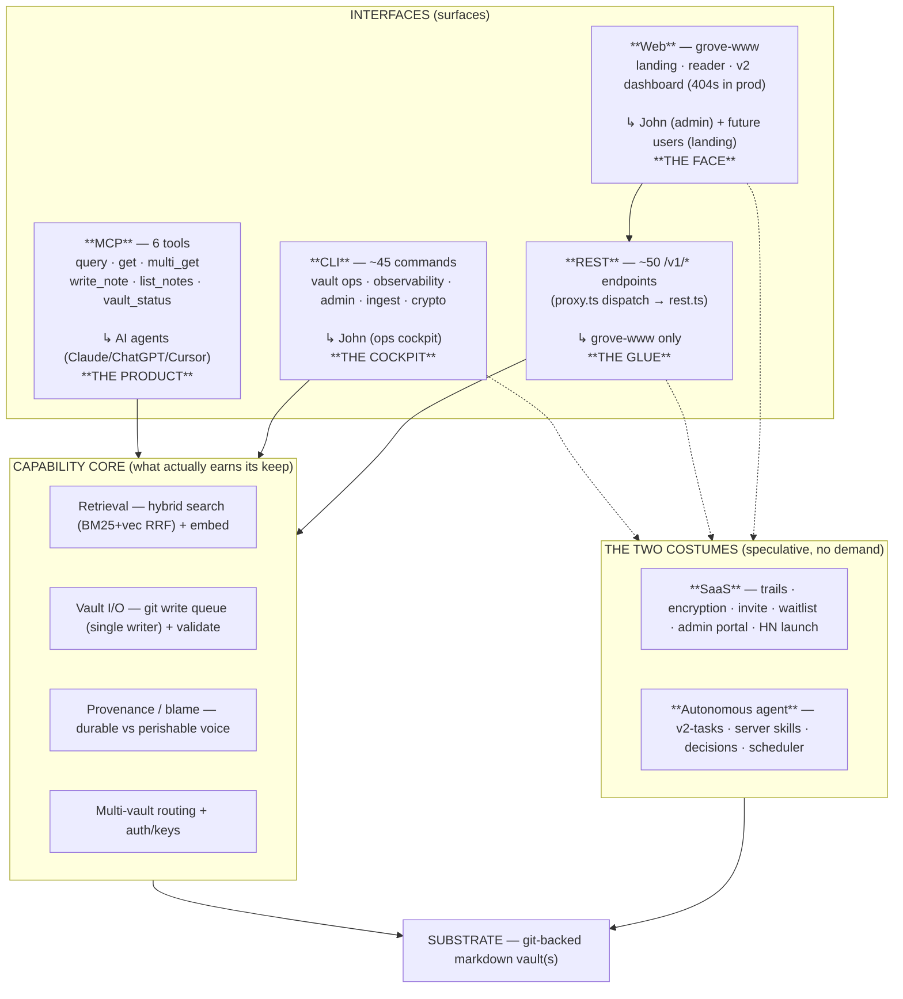

# Grove — Zoom-Out (2026-05-25)

> A systems + product-architecture review across every interface. Written to break the local maximum.

## The one-sentence thesis

**Grove is one product you use every day — a personal knowledge API (6 MCP tools over a git-backed vault) — wearing the costume of two products it has no users for: a multi-tenant SaaS and an autonomous knowledge-gardening agent. The sprawl isn't mess; it's building for a userbase of one. Simplification = take off the two costumes.**

---

## The system, by layer

The four ops the product is *for* — search, read, write, list — are exposed cleanly on every interface. That part is good architecture. Everything painful sits in the two costumes, or in the fact that **the same capability is re-implemented per interface instead of through one shared layer.**

---

## The duplication matrix (the systems problem)

Same capability, exposed/computed N times. The core four are *intentionally* everywhere (fine). The rest is sprawl.

| Capability | MCP | CLI | REST | Web | Server compute | Client skill |
|---|---|---|---|---|---|---|
| Search | `query` | `search` | `/v1/search` | search box | hybrid-search.ts | /garden:seek |
| Read | `get`/`multi_get` | `read` | `/v1/notes` | reader | rest.ts | — |
| Write | `write_note` | `write/delete/move` | `/v1/notes` CRUD | — | rest.ts + write-queue | /garden:plant |
| List | `list_notes` | `list` | `/v1/list` | backlog | rest.ts | — |
| **Health / graph** | `vault_status` (modes) | `graph`·`health`·`diagnostics`·`digest` | `/v1/admin/health`·`/graph` | `/dashboard/health` | **graph-health.ts + vault-graph.ts + vault-stats.ts (3 graph-walks)** | **/garden:tend + /garden:pulse** |
| **Usage / metrics** | `vault_status` perf | `metrics` | `/v1/admin/metrics` + `/admin/usage` HTML | `/dashboard/usage` | **admin-usage.ts + metrics.ts** | — |
| Watchdog | — | — | `/admin/watchdog` | — | **admin-watchdog.ts** | **/grove:watchdog** |
| Keys/admin | — | `keys`·`users`·`rotate`·`revoke` | `/v1/admin/*` | `/dashboard/access/keys` | keys.ts | — |
| **Trails** | — *(never consumed)* | `trail*` | `/v1/trails` | reader + access UI | trails.ts | — |
| **Encryption** | — | `encrypt`·`lock`·`unlock` | `/v1/vault/encrypt` | — | crypto.ts | — |
| Tasks/skills (agent) | — | — | `/v1/tasks`·`/v1/skills` | `/review`·`/task`·`/skills` | v2-* + scheduler + skills/ | — *(server runs autonomously)* |

**Read the bold rows.** "Health" is computed by 3 server modules, exposed on 4 interfaces, and re-done by 2 client skills — ~9 implementations of "how's my vault." "Usage" lives in 2 server renderers + a CLI + a web page. There are **two watchdogs**. That's where consolidation pays.

**Read the bottom three rows.** Trails / encryption / agent are CLI+REST+Web-heavy but **MCP-absent and usage-absent** — built surfaces nobody drives.

---

## The two costumes, with the numbers that settle it

### Costume 1 — Multi-tenant SaaS
- **Trails** — the *stated* core differentiator (50 of 175 fitness points, the HN pitch). 4 trails exist; **all trail-granted keys have `last_used_at = NULL` — not one MCP consumer has ever connected through a trail.** Untouched since 2026-04-24. The only `/trails/*` traffic is your own browser.
- **Encryption** — `vault_keys` table empty; **zero encrypted files across all prod vaults.** Behind TLS + EBS-at-rest, app-layer crypto buys ~nothing for a 1-user tool.
- **Users / funnel** — 3 users, 5 vaults; **John + exactly one active outsider (sharpshoot).** Waitlist: 5 rows, 4 your own smoke-tests, **1 real lead.** `ryan` signed up May 1, never used a key.
- **HN-LAUNCH.md** — "Ready to post" since **2026-04-13. Never fired.** The waitlist collects signups for a launch that hasn't happened.

### Costume 2 — Autonomous knowledge-gardening agent
- **Size** — v2-tasks + server skills + decisions + scheduler = **~8,300 src lines (22% of src) + ~8,600 test lines (27% of all tests).** A quarter of the codebase.
- **No proven demand** — v1 of this exact idea (`daily-vault-review`) was built, shipped, and **deleted for non-use**. Inbox v2 is the *second* attempt at the same bet ("25 items sit untouched on prod"). 10-commit burst on 05-20, then silence.
- **Violates Grove's own constitution** — CLAUDE.md: *"Grove is plumbing, the vault is the cathedral… should never restructure or make policy decisions about vault content."* Yet `enrichment` autonomously rewrites Concept bodies and `links-suggestion` injects wikilinks. `first-run.ts` **auto-enrolls every new vault into LLM-spending autonomous mutation within ~60s of creation, no explicit consent.**
- **It's `goal-md`'s thesis wearing Grove's database** — the MCP core doesn't depend on it; it hangs off `/v1/tasks*` consumed only by the grove-www dashboard. Lifts out cleanly.

---

## The decision (one question forces the rest)

**Do you want Grove to onboard strangers — or to be "your knowledge, everywhere your AI is"?**

Everything downstream falls out of that. The evidence (1 active outsider, 0 trail consumers ever, 0 encrypted vaults, unfired launch, 5x velocity drop, last human feature 05-20) says the honest answer is **personal tool**. My opinion: **declare it personal, take off both costumes, and the system snaps back to a tight, excellent core you'll actually keep improving.** If instead you want the product — then *fire the launch and resource it*; don't keep paying the SaaS tax in limbo. The local maximum is the "both" state.

---

## Prune / consolidate plan (tiered — top is pure subtraction)

### Tier 0 — Provably dead, zero behavior change (~900 lines + 2 repos, do today)
- Delete `src/embed.ts` (OpenAI-era, superseded by Voyage, imported by nobody — 279 lines).
- Delete `src/discovery-neighbors.ts` + its dead `discovery_results` plumbing (no caller since 04-29 — 186 lines).
- Delete `autoHeal` + helpers from `graph-health.ts` (tests-only, no prod caller — ~400 lines).
- Delete repos: `grove-phase-1-2` (fully subsumed by grove, last commit 04-22) and `grove-www-worktrees` (empty mount point). *(Leave `dm/grove-dump-2026-05-03` — it's misnamed interview-prep, not Grove.)*
- Delete `grove-www/SPEC.draft.md` (superseded) and `iterations.jsonl` (abandoned tuning loop).

### Tier 1 — Consolidate the duplicated capabilities
- **One "vault health"** — collapse `graph-health.ts` + `vault-graph.ts` + `vault-stats.ts` into a single graph-walk; let `/garden:tend`/`/garden:pulse` be the *client lens* over it (constitution's partition rule), not a parallel computation.
- **One usage dashboard** — kill the server's hand-rolled `/admin/usage` HTML (`admin-usage.ts renderUsageHtml`); grove-www's styled page wins.
- **One watchdog** — drop `admin-watchdog.ts`; the `/grove:watchdog` skill already owns ops health for a 1-user system.
- **One search path** — `query` MCP tool re-implements `rest.ts handleSearch`; route both through one function.
- **One embed module** — merge the `embed-single` / `embed-node` pair (shared chunking constants drifting by copy-paste).
- **Fold** `provenance-prior.ts` into `provenance.ts` (98 lines, single importer).
- **Split** `proxy.ts` (4,043-line god-file; one 2,800-line handler) — extract OAuth, auth-page HTML, and the `/v1/*` dispatch table into routers. Single biggest readability win.

### Tier 2 — Strategic cuts (follow from the decision)
- **If personal:** freeze + extract the agent (v2-tasks/skills/decisions/scheduler → `goal-md` or its own repo); at minimum turn off `first-run` auto-enable and stop building. Retire trails, encryption, invite/waitlist. Shelve HN-LAUNCH.md. Freeze grove-www's v2 dashboard behind its guard; ship landing + reader + your own admin views.
- **If product:** fire the HN launch, resource trails to actual consumers, finish the v2 backend contract — and *then* the SaaS tax is justified.

### Meta — fix the steering doc
The 175-pt fitness function (last scored at the 04-07 baseline) is **abandoned and lying about direction**: it bets 50 pts on Trails (dead a month) while all real energy went to cost-hardening, multi-vault, and autonomy — none of which it scores. PLAN.md's "current state" is from 04-21 and undercounts the codebase by ~66 modules (25 → 91). **Pick one steering doc. Mark what's truly shipped vs dark-launched vs abandoned. Rewrite GOAL.md to name the real core.**

---

## What's genuinely excellent (keep, with confidence)
The 6-tool MCP discipline. Hybrid search + the live per-write embed path. The git single-writer write-queue. **Provenance/blame** — 475 prod rows, 10 importers, your durable/perishable doctrine made real; *promote it into the core narrative.* The per-vault DB split that makes cross-tenant leaks structurally impossible. The discovery extract→link engine (auto-wikilinking on write). The grove-www design system. None of these are sprawl — they're the cathedral.
