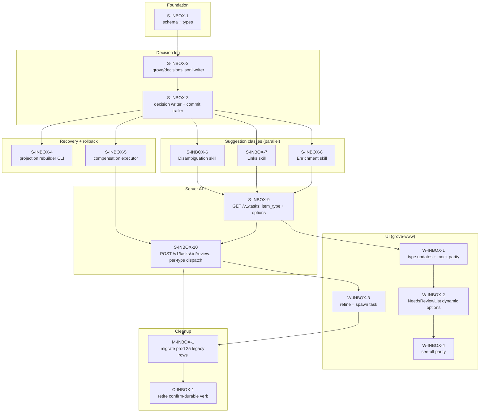

# Inbox v2 — Implementation Plan

> Sibling to [`inbox-v2-spec.md`](./inbox-v2-spec.md). Operational; completed items collapse into "shipped" summary.
> Cross-repo: spans `~/src/grove` (server) and `~/src/grove-www` (UI). Each work item is a single PR.

**Status:** spec locked 2026-05-20. Implementation: not started.
**Reading order for a cold-start agent:** `inbox-v2-spec.md` (the design) → this file (work items + DAG) → repo PLAN.md (conventions, CI, merge authorization).

---

## Implementation DAG



**Critical path (10 hops):** S-1 → S-2 → S-3 → S-6 → S-9 → S-10 → W-1 → W-2 → M-1 → C-1.

## Parallelization windows

| Window | Trigger | Items runnable in parallel | Agents |
|---|---|---|---|
| W1 | Start | S-INBOX-1 | 1 |
| W2 | After S-1 lands | S-INBOX-2 | 1 |
| W3 | After S-3 lands | S-4, S-5, S-6, S-7, S-8 | **5** |
| W4 | After S-6/7/8 ANY lands | S-9 (sequential — modifies v2-tasks.ts) | 1 |
| W5 | After S-9 lands | S-10, W-1 | 2 |
| W6 | After W-1 lands | W-2, W-3 (sequential — both touch review wiring) | 1 |
| W7 | After W-2 lands | W-4 | 1 |
| W8 | After W-3, W-4, S-10, M-1 | M-1 then C-1 (sequential) | 1 |

**Peak concurrency:** 5 agents in W3.

## Per-repo merge protocol

- **grove**: PR → CI must show `verify` + `audit` + `secrets` green → `gh pr merge <n> --auto --squash --delete-branch`. Health-gated workflow_dispatch deploy from Actions tab after main is green. Set `confirm_schema_change=true` on PRs touching `src/migrations/` or `src/db*.ts`.
- **grove-www**: PR → CI must show `check / verify` + `check / audit` + `check / secrets` green → `gh pr merge <n> --auto --squash --delete-branch`. Visual regression must be SUCCESS or branch must not touch UI.

---

## Work items

### S-INBOX-1 — schema migration + types (grove)

**Goal:** add `decisions` + `suppressions` tables and the type definitions every other server-side item depends on.

**Files:**
- new: `src/migrations/vault/003_decisions.sql`
- new: `src/v2-decisions.ts` (types: `Decision`, `Suggestion`, `ReviewOption`, `SuggestionType`, `DecisionStatus`)
- edit: `src/db-types.ts` — add `DecisionRow`, `SuppressionRow`
- edit: `src/v2-tasks.ts:68–83` — extend `Task` with optional `itemType?: SuggestionType` and `options?: ReviewOption[]`

**Schema (`003_decisions.sql`):**
```sql
CREATE TABLE IF NOT EXISTS decisions (
  id              TEXT PRIMARY KEY,
  type            TEXT NOT NULL CHECK (type IN ('disambiguation','link','enrichment')),
  skill_run_id    TEXT NOT NULL,
  task_id         TEXT,
  created_at      TEXT NOT NULL,
  status          TEXT NOT NULL CHECK (status IN ('provisional','confirmed','compensated')) DEFAULT 'provisional',
  payload_json    TEXT NOT NULL,
  options_json    TEXT NOT NULL,
  chosen_option_id TEXT NOT NULL,
  affected_paths_json TEXT NOT NULL,
  compensated_by  TEXT
);
CREATE INDEX IF NOT EXISTS idx_decisions_task ON decisions(task_id);
CREATE INDEX IF NOT EXISTS idx_decisions_status ON decisions(status);

CREATE TABLE IF NOT EXISTS suppressions (
  id              TEXT PRIMARY KEY,
  suggestion_type TEXT NOT NULL,
  entity_key      TEXT NOT NULL,
  suppressed_at   TEXT NOT NULL,
  until           TEXT NOT NULL,
  UNIQUE(suggestion_type, entity_key)
);
```

**Falsifier:**
```bash
cd ~/src/grove && npm test -- --run test/decisions-schema.test.ts
# new test file inserts row into decisions, asserts shape; types must compile (tsc --noEmit)
```

**Depends on:** none.
**Parallel-safe with:** anything that doesn't touch v2-tasks.ts (none in W3 do).
**Blast radius:** small — additive.
**Status:** not-started.

---

### S-INBOX-2 — `.grove/decisions.jsonl` writer (grove)

**Goal:** durable, append-only event log living in the vault working tree.

**Files:**
- new: `src/decisions-log.ts` — exports `appendDecisionEvent(vault, event)`, `readDecisionEvents(vault, predicate?)`, `ensureDecisionsLogDir(vault)`
- new: `test/decisions-log.test.ts`

**Behavior:**
- Lazily creates `<vaultPath>/.grove/` and `decisions.jsonl` on first write
- One JSON object per line, schema mirrors `Decision` from S-INBOX-1
- Read is streaming (don't load entire file into memory)
- Writes are flushed before commit so the JSONL line + the vault changes land in the same commit

**Falsifier:**
```bash
cd ~/src/grove && npm test -- --run test/decisions-log.test.ts
# write 3 events, read back exactly 3 in order; assert file is at .grove/decisions.jsonl
```

**Depends on:** S-INBOX-1 (Decision type).
**Parallel-safe with:** S-INBOX-1 is the only prereq; nothing else in flight at this point.
**Blast radius:** zero (new file).
**Status:** not-started.

---

### S-INBOX-3 — decision writer + commit-trailer extension (grove)

**Goal:** single API to record a decision: JSONL append + state.db row + git commit with `decision-id:` trailer in the same atomic unit.

**Files:**
- new: `src/decision-writer.ts` — `recordDecision(vault, decision)`, `commitSkillRun(vault, paths, msg, decisions[])`
- edit: `src/vault-ops.ts:185–209` — extend `gitCommitPaths` to accept decision-id list in trailers (reuse `provenance.ts` trailer composition pattern)
- new: `test/decision-writer.test.ts`

**Behavior:**
- Single transaction: insert state.db row + append JSONL line
- On commit, the JSONL line is part of `paths[]` (committed alongside the changes it describes)
- Commit message footer: `Decision-Id: D-…` per decision; existing `Provenance-…` trailers also retained

**Falsifier:**
```bash
cd ~/src/grove && npm test -- --run test/decision-writer.test.ts
# record 1 decision, assert: (a) state.db row present (b) .grove/decisions.jsonl has 1 line (c) git log -1 shows Decision-Id trailer
```

**Depends on:** S-INBOX-1, S-INBOX-2.
**Parallel-safe with:** nothing — modifies `vault-ops.ts`.
**Blast radius:** medium — `gitCommitPaths` is called by `writeNoteFile` callers; new arg must default to empty so existing callers are uneffected.
**Status:** not-started.

---

### S-INBOX-4 — projection rebuilder CLI (grove)

**Goal:** `grove rebuild-projection <vault>` replays `.grove/decisions.jsonl` into the `decisions` table. Used when state.db is lost/corrupted.

**Files:**
- edit: `src/cli.ts` — add `rebuild-projection` subcommand
- edit: `src/decision-writer.ts` — extract `replayDecisionsFromLog(vault)` if not already

**Falsifier:**
```bash
cd ~/src/grove && npm test -- --run test/decision-replay.test.ts
# seed JSONL with 3 events, wipe decisions table, run replay, assert table contains those 3 rows
```

**Depends on:** S-INBOX-2, S-INBOX-3.
**Parallel-safe with:** S-INBOX-5, S-INBOX-6, S-INBOX-7, S-INBOX-8 (all touch different files).
**Blast radius:** zero (CLI subcommand).
**Status:** not-started.

---

### S-INBOX-5 — compensation executor (grove)

**Goal:** per-type "undo" — given a decisionId and (optional) new choice, compute the inverse mutation and emit a new compensating commit.

**Files:**
- new: `src/decision-compensate.ts` — `compensateDecision(vault, decisionId, newChoice?)`
- new: `test/decision-compensate.test.ts`

**Per-type compensators:**
- `link` → remove the link, optionally add new one to `newChoice` target
- `disambiguation` → unlink from prior target, optionally relink to `newChoice`
- `enrichment` → restore prior content (stored in `payload_json.prior_content`)

**Behavior:**
- Never `git revert`. Always forward — emits a new commit with `Compensates-Decision-Id: D-…` trailer
- Marks original decision `status = 'compensated'`, sets `compensated_by` to new decision id
- Does NOT cascade — downstream work that built on the original decision stays as-is

**Falsifier:**
```bash
cd ~/src/grove && npm test -- --run test/decision-compensate.test.ts
# for each type: apply decision, compensate, assert vault file matches pre-decision state, assert status=compensated
```

**Depends on:** S-INBOX-1, S-INBOX-3.
**Parallel-safe with:** S-INBOX-4, S-INBOX-6, S-INBOX-7, S-INBOX-8.
**Blast radius:** zero (new file).
**Status:** not-started.

---

### S-INBOX-6 — Disambiguation suggestion skill (grove)

**Goal:** scan Journal entries for ambiguous Person mentions (e.g., "Anna" with 2+ matching People notes), pick best candidate, apply provisional link, record decision.

**Files:**
- new: `src/skills/disambiguation.ts`
- new: `test/skills-disambiguation.test.ts`
- edit: `src/skills/registry.ts` — register

**Behavior:**
- Scan `Journal/**/*.md` for Person mentions (surface-form match against `Resources/People/`)
- If 2+ candidates with overlapping aliases → emit Disambiguation decision with all candidates as `options`
- Best-guess: top candidate by (recency of last mention × backlink count)
- Apply provisional link in the Journal entry
- Affected paths: just the Journal entry that got the link

**Falsifier:**
```bash
cd ~/src/grove && npm test -- --run test/skills-disambiguation.test.ts
# fixture: 2 People named Anna + 1 Journal entry mentioning "Anna"
# run skill, assert: 1 decision recorded with type='disambiguation', vault Journal entry has [[Anna X]] link
```

**Depends on:** S-INBOX-1, S-INBOX-3.
**Parallel-safe with:** S-INBOX-7, S-INBOX-8, S-INBOX-4, S-INBOX-5.
**Blast radius:** small (additive skill).
**Status:** not-started.

---

### S-INBOX-7 — Links suggestion skill (grove)

**Goal:** find unlinked Person/Concept/Company surface-mentions in notes, propose link to top candidate, apply provisional.

**Files:**
- new: `src/skills/links-suggestion.ts`
- new: `test/skills-links-suggestion.test.ts`
- edit: `src/skills/registry.ts`

**Behavior:**
- Sweep all `Resources/**` + `Journal/**` for raw surface mentions of entities that have notes but aren't wikilinked
- For each: emit Link decision with target candidate(s), apply provisional link
- Highest volume; per-run cap (e.g., 20 decisions) to prevent inbox flood

**Falsifier:**
```bash
cd ~/src/grove && npm test -- --run test/skills-links-suggestion.test.ts
# fixture: 1 note mentioning "[[X]]" already + 1 note mentioning "X" raw
# run skill, assert: 1 decision recorded, raw mention becomes [[X]]
```

**Depends on:** S-INBOX-1, S-INBOX-3.
**Parallel-safe with:** S-INBOX-6, S-INBOX-8, S-INBOX-4, S-INBOX-5.
**Blast radius:** small.
**Status:** not-started.

---

### S-INBOX-8 — Enrichment skill (rewrite of daily-vault-review) (grove)

**Goal:** identify thin Concept notes, draft expansion from Journal mentions + backlinks, apply provisional enrichment, record decision with `prior_content` for compensation.

**Files:**
- new: `src/skills/enrichment.ts`
- new: `test/skills-enrichment.test.ts`
- edit: `src/skills/registry.ts`
- edit: `src/skills/daily-vault-review.ts` — mark deprecated, schedule removal in C-INBOX-1

**Behavior:**
- Find Concepts with body length < threshold (e.g., 200 chars) and ≥ 3 backlinks
- For each: Claude Haiku drafts ~4 paragraphs grounded in backlink context
- Apply enrichment to the note, record decision with `prior_content` in payload
- Cost ceiling applies (reuse `src/skills/cost-ceiling.ts`)

**Falsifier:**
```bash
cd ~/src/grove && npm test -- --run test/skills-enrichment.test.ts
# fixture: 1 thin Concept with 3 backlinks
# run skill with mocked Anthropic client, assert: 1 decision recorded with payload.prior_content set, note body extended
```

**Depends on:** S-INBOX-1, S-INBOX-3.
**Parallel-safe with:** S-INBOX-6, S-INBOX-7, S-INBOX-4, S-INBOX-5.
**Blast radius:** small until daily-vault-review removed (C-INBOX-1).
**Status:** not-started.

---

### S-INBOX-9 — GET /v1/tasks returns item_type + options (grove)

**Goal:** extend the existing backlog payload so review-state tasks expose their suggestion type and option set.

**Files:**
- edit: `src/v2-tasks.ts:323` — `buildBacklogPayload` JOINs `decisions` on `task_id`
- edit: `src/v2-tasks.ts:68–83` — `Task` already extended in S-INBOX-1; ensure mapping populates

**Behavior:**
- For each review-state task: look up decision by task_id, attach `itemType` + `options` (parsed from `options_json`)
- Tasks without a decision (legacy) return undefined for both — UI handles gracefully

**Falsifier:**
```bash
cd ~/src/grove && npm test -- --run test/v2-tasks-itemtype.test.ts
# seed task + decision rows, GET /v1/tasks, assert response includes itemType and options[] for the linked task
```

**Depends on:** S-INBOX-1, S-INBOX-6 (or 7 or 8) — needs at least one suggestion class generating decisions.
**Parallel-safe with:** none — modifies `buildBacklogPayload`.
**Blast radius:** medium — the shape change is additive but it's THE backlog endpoint.
**Status:** not-started.

---

### S-INBOX-10 — POST /v1/tasks/:id/review per-type dispatch (grove)

**Goal:** the review endpoint becomes type-aware: `apply <option_id>` → no-op if matches current; `apply <other_option_id>` → trigger compensation + re-execute; `refine <text>` → spawn new task; `dismiss` → write suppression row.

**Files:**
- edit: `src/v2-task-review.ts:41` — extend `ReviewAction` shape: `{kind: "apply" | "refine" | "dismiss", option_id?: string, refinement?: string}` (replaces literal verb union)
- edit: `src/v2-tasks.ts:547` — `parseReviewBody` accepts new shape
- edit: `src/v2-tasks.ts:581` — `handleV2TaskReview` dispatches per-type

**Behavior:**
- `apply` with same `option_id` as decision.chosen_option_id → mark confirmed, clear provisional
- `apply` with different `option_id` → call S-INBOX-5 `compensateDecision(vault, decisionId, newChoice)`
- `refine {text}` → spawn new task with text as directive, mark original compensated
- `dismiss` → insert `suppressions` row, mark decision compensated, no vault change

**Falsifier:**
```bash
cd ~/src/grove && npm test -- --run test/v2-task-review-dispatch.test.ts
# 4 sub-tests, one per action; assert state.db + vault + JSONL changes per type
```

**Depends on:** S-INBOX-3, S-INBOX-5.
**Parallel-safe with:** S-INBOX-9 (different files — wait actually both touch v2-tasks.ts. SERIALIZE WITH S-9).
**Blast radius:** large — this IS the action surface.
**Status:** not-started.

---

### W-INBOX-1 — type updates + mock parity (grove-www)

**Goal:** grove-www `Task` type matches new server shape; mock impl emits item_type/options; live impl maps from server response.

**Files:**
- edit: `src/lib/grove-api.v2.types.ts` — add `itemType?: SuggestionType` and `options?: ReviewOption[]` to Task
- edit: `src/lib/grove-api.v2.mock.ts` — seed fixtures with example items per type
- edit: `src/lib/grove-api.v2.live.ts` — pass through from server (no transformation needed if server matches)
- edit: `src/app/(resident)/[atHandle]/[vaultSlug]/_actions/review.ts` — new action signature `(taskId, optionId | refinement | dismiss, vaultSlug)`

**Falsifier:**
```bash
cd ~/src/grove-www && npm run check
# typecheck passes; mock fixture renders with new fields visible in test output
```

**Depends on:** S-INBOX-9 deployed (or run in mock mode against fixture shape).
**Parallel-safe with:** nothing — touches types + actions.
**Blast radius:** medium — types propagate.
**Status:** not-started.

---

### W-INBOX-2 — NeedsReviewList renders dynamic options (grove-www)

**Goal:** the review row stops rendering 4 fixed buttons (confirm/refine/dismiss/stale) and instead renders one button per `task.options`, plus a refine affordance.

**Files:**
- edit: `src/components/backlog/needs-review-list.tsx` — read `task.options`, render dynamic buttons
- edit: `src/app/(resident)/[atHandle]/[vaultSlug]/_client-shell.tsx` — `BacklogIsland` handlers dispatch by `option.id`, not fixed verb
- edit: `src/components/task/review-item.tsx` — same dynamic rendering for the see-all surface

**Falsifier:**
```bash
cd ~/src/grove-www && npm run check && npm run test:visual
# unit test: render with options of length 3, assert 3 buttons; visual diff approved
```

**Depends on:** W-INBOX-1.
**Parallel-safe with:** nothing — shared component contract.
**Blast radius:** medium — visible UI change.
**Status:** not-started.

---

### W-INBOX-3 — refine = spawn task (grove-www)

**Goal:** refine modal submission no longer maps to a `review` action; instead it calls a new Server Action that spawns a free-instruction task.

**Files:**
- edit: `src/components/task/refine-modal.tsx` — props unchanged but onSubmit calls new action
- edit: `src/app/(resident)/[atHandle]/[vaultSlug]/_actions/review.ts` — `refineTask(taskId, instruction, vaultSlug)` → calls new live endpoint
- edit: `src/lib/grove-api.v2.live.ts` — `refineTask` wire impl

**Falsifier:**
```bash
cd ~/src/grove-www && npm test -- --run src/lib/grove-api.v2.test.ts
# new tests pin: refineTask POSTs to /v1/tasks/:id/review with kind="refine"; server response asserts new task created
```

**Depends on:** S-INBOX-10.
**Parallel-safe with:** W-INBOX-2 if they don't share files (review-item.tsx is the overlap — coordinate).
**Blast radius:** small.
**Status:** not-started.

---

### W-INBOX-4 — see-all parity (grove-www)

**Goal:** `/review` route uses the same dynamic-options + refine-spawn behavior as the dashboard surface.

**Files:**
- edit: `src/app/(resident)/[atHandle]/[vaultSlug]/review/review-all-client.tsx` — mirror W-INBOX-2 changes

**Falsifier:**
```bash
cd ~/src/grove-www && npm run check && npm run test:visual
# visual diff of /review at 375px and 1280px
```

**Depends on:** W-INBOX-2.
**Parallel-safe with:** nothing — small but isolated.
**Blast radius:** small.
**Status:** not-started.

---

### M-INBOX-1 — migrate prod 25 legacy review rows (grove)

**Goal:** the 25 review-state tasks currently in prod were emitted by the old daily-vault-review skill (no decision attached). Resolve them.

**Files:**
- new: `scripts/migrate-inbox-v2.ts` — one-shot migration
- new: `scripts/migrate-inbox-v2.test.ts`

**Behavior:**
- For each legacy review task: mass-dismiss (mark `state='dismissed'`, log to a one-off `migration_events` table for audit)
- Print summary on completion
- Idempotent — safe to re-run

**Falsifier:**
```bash
# Local dry-run against a cloned prod state.db copy
GROVE_VAULT=personal node --import tsx scripts/migrate-inbox-v2.ts --dry-run
# Asserts: 25 rows found, 25 would be dismissed, 0 errors
# Real run: --apply flag, then ssh prod and verify SELECT count(*) WHERE state='review' = 0 (or = new decision-backed items only)
```

**Depends on:** W-INBOX-3, W-INBOX-4, S-INBOX-10 all deployed (clients on new model).
**Parallel-safe with:** nothing (one-shot prod write).
**Blast radius:** large — touches prod data. Falsifier-first required (CLAUDE.md diagnostic discipline #1).
**Status:** not-started.

---

### C-INBOX-1 — retire confirm-durable verb (grove + grove-www)

**Goal:** remove the legacy `confirm-durable | refine | dismiss | mark-stale` ReviewAction union now that nothing uses it.

**Files:**
- edit: `src/v2-task-review.ts:41` — remove old union
- edit: `src/v2-tasks.ts:547` — simplify `parseReviewBody`
- edit: `src/skills/daily-vault-review.ts` — delete file
- edit: `src/skills/registry.ts` — unregister
- delete grove-www: `src/lib/grove-api.v2.live.ts` legacy `reviewTask` translation block (the `{kind: "confirm-durable"}` body shape fix from PR #71)

**Falsifier:**
```bash
cd ~/src/grove && npm run typecheck && npm test
cd ~/src/grove-www && npm run check
# grep for "confirm-durable" returns 0 hits in both repos
```

**Depends on:** M-INBOX-1.
**Parallel-safe with:** nothing.
**Blast radius:** medium — type union narrowing; all callers should already be on new shape.
**Status:** not-started.

---

## Acceptance for "Inbox v2 v1 shipped"

- [ ] All 3 suggestion classes generating decisions on prod (`SELECT type, count(*) FROM decisions GROUP BY type` — all 3 > 0)
- [ ] Roll-back tested end-to-end on at least one decision type (manual: apply different option, verify compensating commit + vault state)
- [ ] `confirm-durable` verb gone from both repos (`rg "confirm-durable"` returns nothing)
- [ ] `daily-vault-review` skill removed from registry
- [ ] Prod has 0 legacy review-state rows
- [ ] `.grove/decisions.jsonl` exists in prod vault and is in sync with `decisions` table (replay test)

## Deferred (out of v1)

- Maturation/lifecycle suggestion class
- Notifications / push on new inbox items
- Suppression learning beyond N-day timeout
- Cascade scope expansion (today: just X)
- Unification with `Inbox/` folder
- Frontend telemetry on which option gets picked
